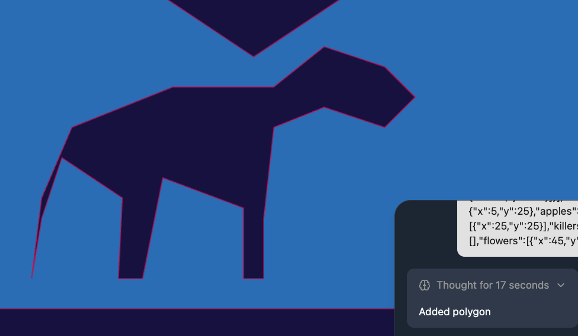

# Changelog

All notable changes to this project will be documented in this file.

## [Ongoing]

- Feedback from @Isty. Remove apple gravity shortcut which conflict with select tool on S (gravity down).

## 2025-12-11

- Improved LGR support and added picture tool (only default distance and clipping for now).
- Update toolbars positioning, controls are back to the left side.
- Added base undo/redo feature.
- Added hand tool for panning the view.

## 2025-12-01

- Updated on feedback from `@insguy`:
  - Instead of canceling add polygon on changing tool, add it.
  - Not clear save and save as do same thing for me (just download lev) - clarified in UI (Chrome only supports file pickers).
  - Increased zoom out/in steps to reduce number of clicks.
  - Changed P (Polygon) to V (Vertex) V is more intuitive and easier to reach.
- Add default LGR support for current kuski, apples, killers and exit objects drawings.

## 2025-11-27

- First Battle by `@insguy` using the level editor: https://elma.online/battles/209393
- Fixed vertex being truncated on download, making close vertices end up with the same coordinates causing internal errors.
- Thanks to `@Markku` for identifying and reporting this issue.

## 2025-11-26

- File session now tracks file handles using [File System Access API](https://developer.mozilla.org/en-US/docs/Web/API/File_System_API)
- Supports save/save-as via the picker with permission checks, and falls back to download when pickers are unavailable.
- Save flow now requests write permission and gracefully falls back to download when saving to disk is blocked.
- Canvas resizing is now batched and preserves the bitmap to avoid flicker while keeping the view fitted to the container.
- Chat/OpenAI toggle controls are hidden to declutter the editor UI when the feature is not in use.

## 2025-11-25

- Hid the chat button for now to declutter the editor UI.
- Updated the file session flow to align picker prompts and save handling.

## 2025-11-24

- Renamed a few editor pieces for consistency and merged AI tool work from PR #1.
- Applied a handful of polish fixes around layout and interactions.

## 2025-08-21

- Initial tests with AI assistant integration for level editing. Here is a horse made with AI:
  

## 2025-08-03

- ToolRegistry introduced for polygon, selection, and object tools.
- Built-in levels dialog with search/filter and classic desktop-focused sidebar layout.
- Large EditorEngine refactor for utility-driven event handling, camera ops, and rendering.
- Removed mobile support until the editor is more mature as it adds too much complexity at the moment.

## 2025-08-02

- Finished polygon-on-click behavior using vertex proximity
- Download and import level support.
- Hand tool with keyboard/mouse/touch panning.

- Camera panning corrected, sprite positioning tweaked, and selection deletion enabled.
- Sidebar enhanced with shortcuts, search, and better tool display; improved camera/selection handling.
- Debug mode in EditorEngine for polygon orientation, with clearer sidebar title.

## 2025-08-01

- Base level editor scaffolded (create-react-router initial commit plus core editor setup).
